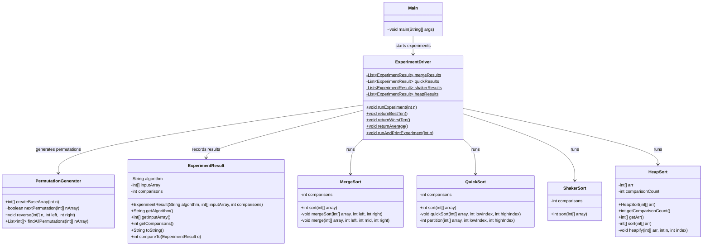

# UML Class Diagram

This diagram represents the class structure and relationships for Programming Project 1.

```mermaid
classDiagram

    class Main {
        ~void main(String[] args)$
    }
    
    class ExperimentDriver {
        -List~ExperimentResult~ mergeResults$
        -List~ExperimentResult~ quickResults$
        -List~ExperimentResult~ shakerResults$
        -List~ExperimentResult~ heapResults$

        +void runExperiment(int n)$
        +void returnBestTen()$
        +void returnWorstTen()$
        +void returnAverage()$
        +void runAndPrintExperiment(int n)$
    }

    class ExperimentResult {
        -String algorithm
        -int[] inputArray
        -int comparisons

        +ExperimentResult(String algorithm, int[] inputArray, int comparisons)
        +String getAlgorithm()
        +int[] getInputArray()
        +int getComparisons()
        +String toString()
        +int compareTo(ExperimentResult o)
    }

    class PermutationGenerator {
        +int[] createBaseArray(int n)
        ~boolean nextPermutation(int[] nArray)
        ~void reverse(int[] n, int left, int right)
        +List~int[]~ findAllPermutations(int[] nArray)
    }

    class MergeSort {
        -int comparisons

        +int sort(int[] array)
        -void mergeSort(int[] array, int left, int right)
        -void merge(int[] array, int left, int mid, int right)
    }

    class QuickSort {
        -int comparisons

        +int sort(int[] array)
        -void quickSort(int[] array, int lowIndex, int highIndex)
        -int partition(int[] array, int lowIndex, int highIndex)
    }

    class ShakerSort {
        -int comparisons

        +int sort(int[] array)
    }

    class HeapSort {
        -int[] arr
        -int comparisonCount

        +HeapSort(int[] arr)
        +int getComparisonCount()
        +int[] getArr()
        -int[] sort(int[] arr)
        -void heapify(int[] arr, int n, int index)
    }

    Main --> ExperimentDriver : starts experiments

    ExperimentDriver --> PermutationGenerator : generates permutations
    ExperimentDriver --> ExperimentResult : records results
    ExperimentDriver --> MergeSort : runs
    ExperimentDriver --> QuickSort : runs
    ExperimentDriver --> ShakerSort : runs
    ExperimentDriver --> HeapSort : runs
```
